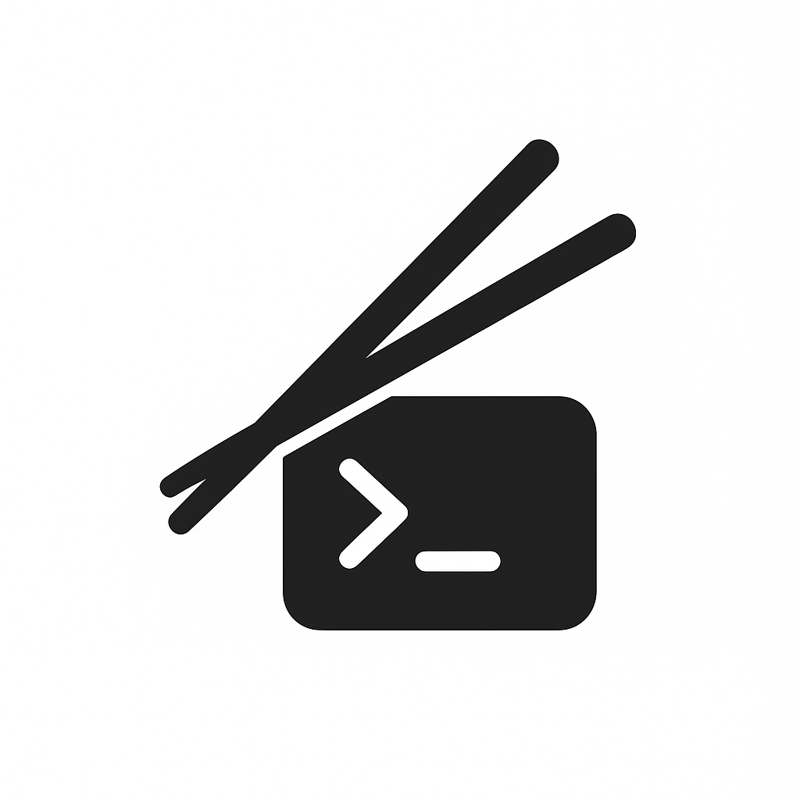
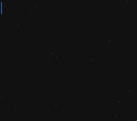
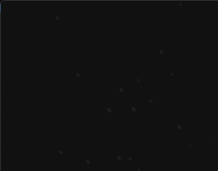

  <p style="font-size: 1.5em; font-weight: bold;" align="left">Chopstick</span>
<p align="left">
  
  
</p>
    <a href="https://github.com/DustinMeyer1010/chopstick/releases"></a>
    <a href="https://pkg.go.dev/github.com/DustinMeyer1010/chopstick?tab=doc"></a>


  Chopstick is a Go package that gives your terminal a pair of imaginary chopsticks for moving and drawing. It tracks a “cursor” (the chopstick) and keeps it within the boundaries of your terminal. You can plate up elements text, symbols, or small UI components and the chopstick will serve them neatly on the terminal, making it quick and easy to build interactive and visually appealing terminal GUIs.


# Motivation 

When using other package that deal with terminal GUI, I feel that you have to use pre-determind function to set the location or get a specific look. What I want is to be able to tell my cursor to go to specific location and draw that item. Then define specific element that would be drawn when needed. So you can update on the fly to create an animation. 

# How to use
1. Import the package
    ```shell
    go get github.com/DustinMeyer1010/chopstick
    ```
2. Create a chopstick
    ```go
    stick := chopstick.NewChopstick()
    ```
## Movement
Use Up, Right, Left, Down methods to move chopstick
```go
stick.Right()
stick.Left()
stick.Down()
stick.Up()
```

## Ingredients & Bento
For saving a specific design and drawing it whenever needed

### Ingredients
Create a single item to draw in the terminal

1. Create an Ingredients & chopstick
    ```go
    stick := chopstick.NewChopstick()
    redbar :=chopstick.Ingredients{
            Position: chopstick.Position{X: 0, Y: 5},
            Value:    "\033[1;32;41m          \033[0m",
        }
    ```
2. Draw Ingredients giving it the chopsticks
    ```go
    redbar.Draw(&stick)
    ```
    


### Bento
Combine a bunch of Ingredients to draw all at once

1. Create all your Ingredients 
    ```go
      stick := chopstick.NewChopstick().
      Terminal(
        chopstick.NewTerminal().ALTERNATE(),
        ).
        Shape(chopstick.BlinkingBar)

      redbar := chopstick.Ingredients{
        Position: chopstick.Position{X: 2, Y: 5},
        Value:    "\033[1;32;41m         \033[0m",
      }
      redbar1 := chopstick.Ingredients{
        Position: chopstick.Position{X: 1, Y: 6},
        Value:    "\033[1;32;41m           \033[0m",
      }
      redbar2 := chopstick.Ingredients{
        Position: chopstick.Position{X: 1, Y: 7},
        Value:    "\033[1;32;41m           \033[0m",
      }
      redbar3 := chopstick.Ingredients{
        Position: chopstick.Position{X: 2, Y: 8},
        Value:    "\033[1;32;41m         \033[0m",
      }

      bento := chopstick.Bento{redbar, redbar1, redbar2, redbar3}
    ```

2. Draw the bento
    ```go
    bento.Draw(&stick)
    ```
    