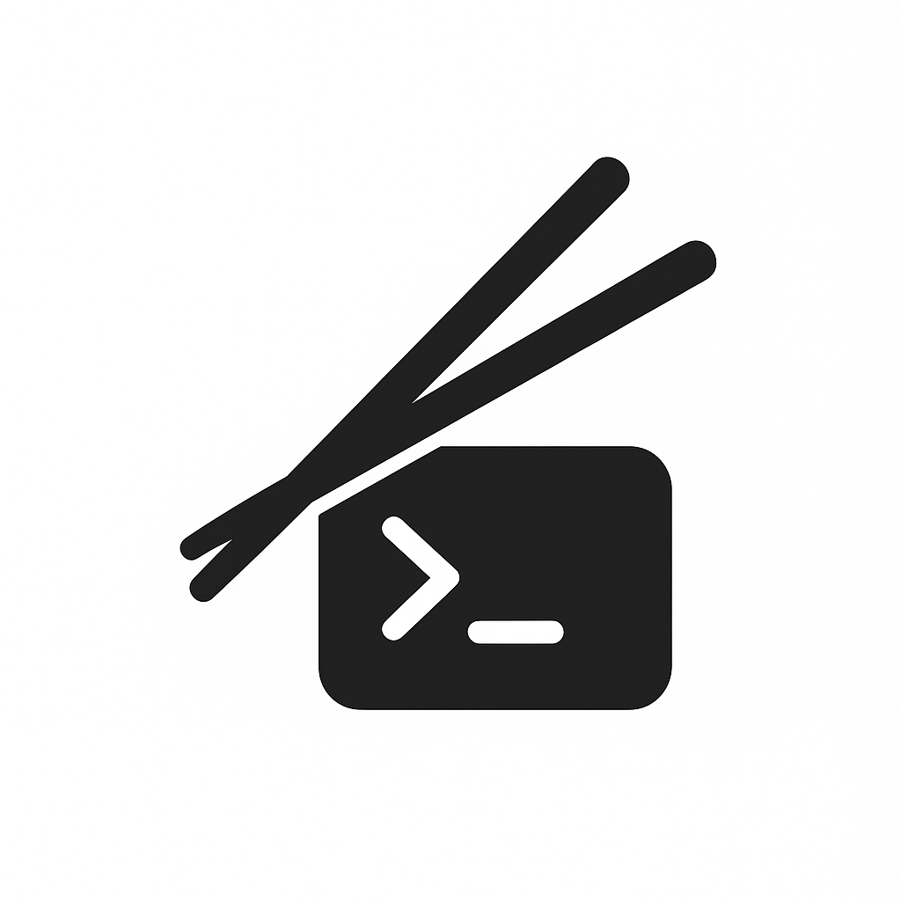

  
Chopstick

  
  

    
    

  Chopstick is a Go package that gives your terminal a pair of imaginary chopsticks for moving and drawing. It tracks a “cursor” (the chopstick) and keeps it within the boundaries of your terminal. You can plate up elements — text, symbols, or small UI components — and the chopstick will serve them neatly on the terminal, making it quick and easy to build interactive and visually appealing terminal GUIs.

# How to Use